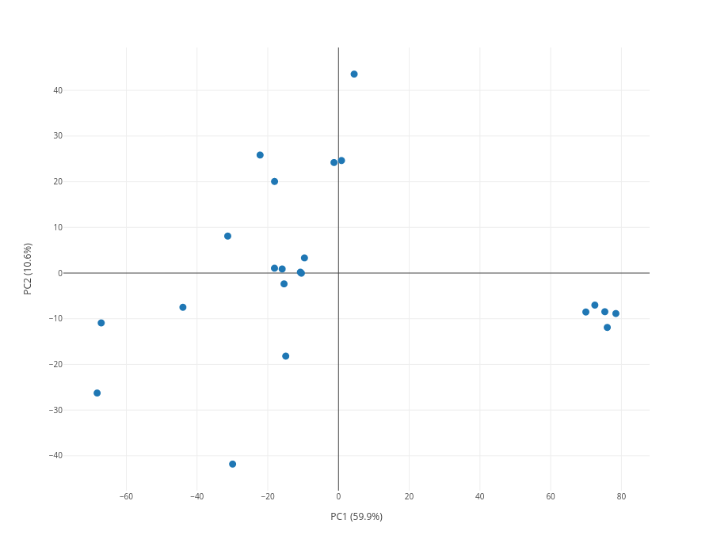
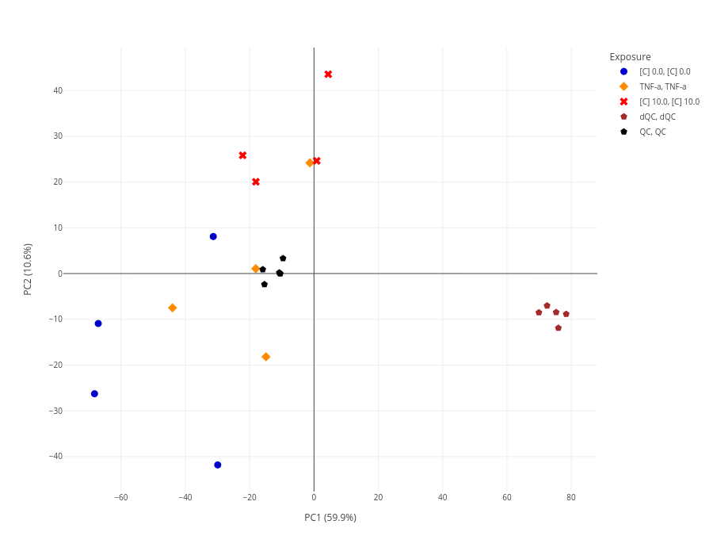
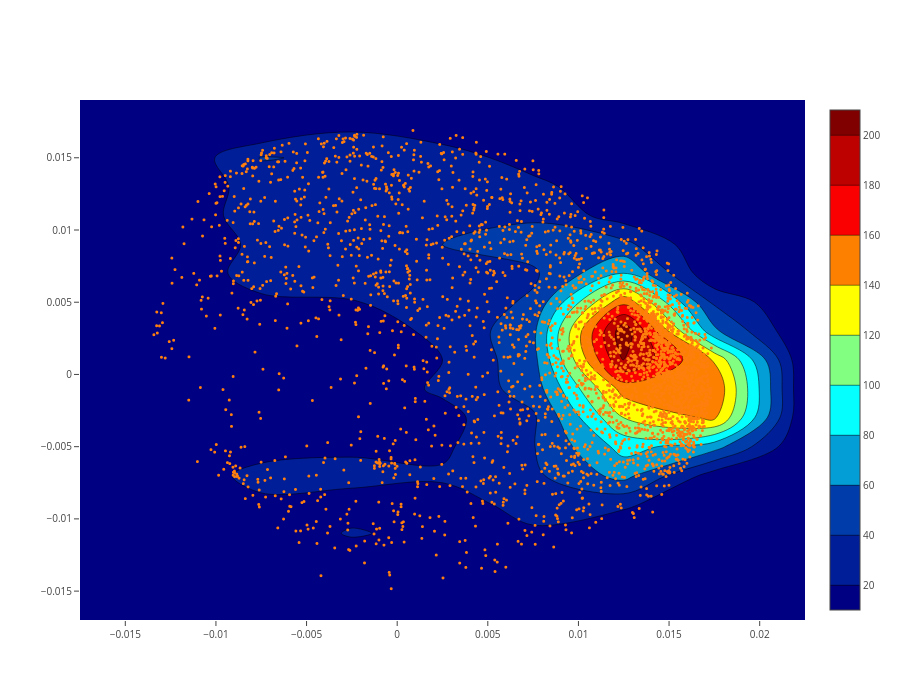
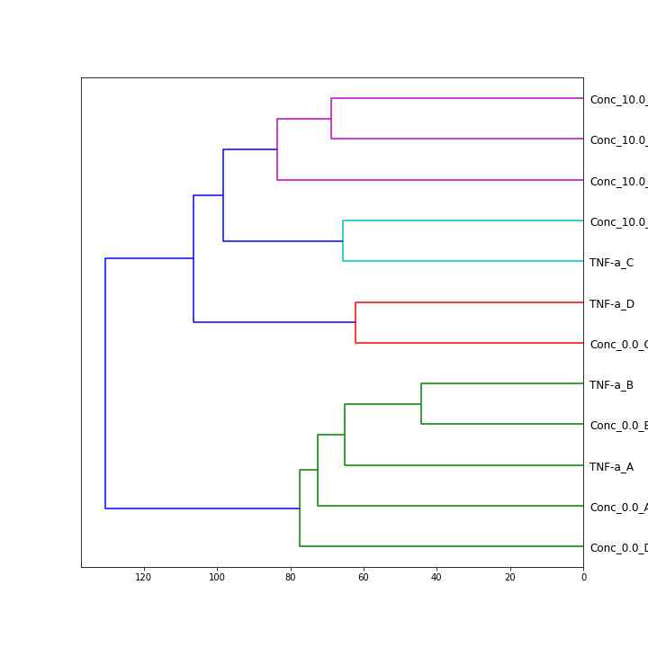

**cheMLearning** library provides of high-level, user-friendly tools to perform common chemometrics analysis in untargeted metabolomics.
Modelling is done using scikit-learn framework, for machine learning; while visualizations are mainly done with Plotly.

Main modules are: 
- unsupervised_modelling 
- supervised_modelling
- utils

## Installation

```python
pip install cheMLearning
```
within a Jupyter Notebook cell

```python
!pip install cheMLearning
```

# Tutorial

## Unsupervised modelling

Unsupervised class works around `Principal Component Analysis`, facilitating the visualization of score and loading plots. Moreover, `Hierarchical Clustering Analysis` can be called on the principal components and visualize a score plot where the color code is given by the clusters of the HCA.

Visualizations can be obtained without having to manipulate scores or loadings. However, if one would like to access to these outputs, they can be accessed via class modules.

Let's say we have a data frame (`df`) containing 3 groups from a toxicology assay and 2 groups of QCs. The number of features is 3255.

**Import**

```python
from cheMLearning.unsupervised_modelling import unsupervised_class
```

```python
df = pd.read_csv("path_to_your_df")
```

```python
# create an object which will contain all your PCA information
output = unsupervised_class()
```

```python
# now call PCA_ready method to compute scores and loadings. 
output.PCA_ready(df)
```

Now we are ready to visualize a PCA-score plot

```python
output.score_viz(pcx=0, pcy=1)
```



Now we have our score plot, however, all data points are the same color which makes it hard to interpret. We can try adding some information to the plot, such as
what to use to color the data, the color sequence we would like to use and even symbols, to help people who might have hard problems differentiating colors.


```python
color = ["[C] 0.0", "[C] 0.0","[C] 0.0","[C] 0.0", "TNF-a","TNF-a","TNF-a","TNF-a","[C] 10.0", "[C] 10.0",
"[C] 10.0","[C] 10.0"]
color_seq=["mediumblue","darkorange", "red"]
symbol_seq=["circle","diamond", "x"]

output.score_viz(pcx=0, pcy=1, color=color, color_discrete_sequence=color_seq, symbol=color, symbol_sequence=symbol_seq)
```


Furthermore, we can visualize our loadings in a scatter plot, a.k.a loading plot, which can bring more information to our analysis.

```python
output.loading_contourplot(pcx=0, pcy=1)
```



To save your plots, just assign the image to a variable and then use the `to_image()` method from plotly.

```python
loading_plot=output.loading_contourplot(pcx=0, pcy=1)
loading_plot.to_image("path_to_your_folder/loading_plot.png")
```

One might suspect that the data misses normalization. `cheMLearining` has a function implementing `median-based PQN normalization`. This function returns your df normalized and also writes it for you.

Make sure your data contains both QCs and dQCs, otherwise it will give you problems.

```python
output.PQN("path_to_your_df") #it must be in separated by commas ",".

#you can save the output by assign it to a variable
df_pqn = output.PQN("path_to_your_df")
```

Hierarchical Clustering Analysis can be now performed and the dendrogram visualized. Let's say we got rid of the QCs.

```python
output.HCA_dendrogram(label=df_pqn.iloc[0:12,].index);
```




## Supervised modelling

Supervised class includes `Partial Least Squares` and `Random Forest` which can be used for either regression or classification tasks. PLS is computed with the NIPALS algorithm.

In the PLS modelling, tools to compute goodness metrics, i.e. R² and Q², VIPs, are provided. In addition to a static functions to ease feature extraction VIP for a 
given VIP threshold.

For RF modelling, it can be computed the distance matrix for a RF-classifier model. It allows tracking where the observations land in the forest.

Analytical tools for classifiers are also provided by facilitating a classification report.

**Import**

```python
from cheMLearning.unsupervised_modelling import supervised_class
```

## Utils

Here, tools to create confusion matrices and ROC curves are provided.
In case one is working with MetaboRank (MR) tool, a function to read MR's output is provided.

**Import**

```python
from cheMLearning import utils
```

Change Log
==========

0.0.1 (09/11/2022)
------------------
- First Release